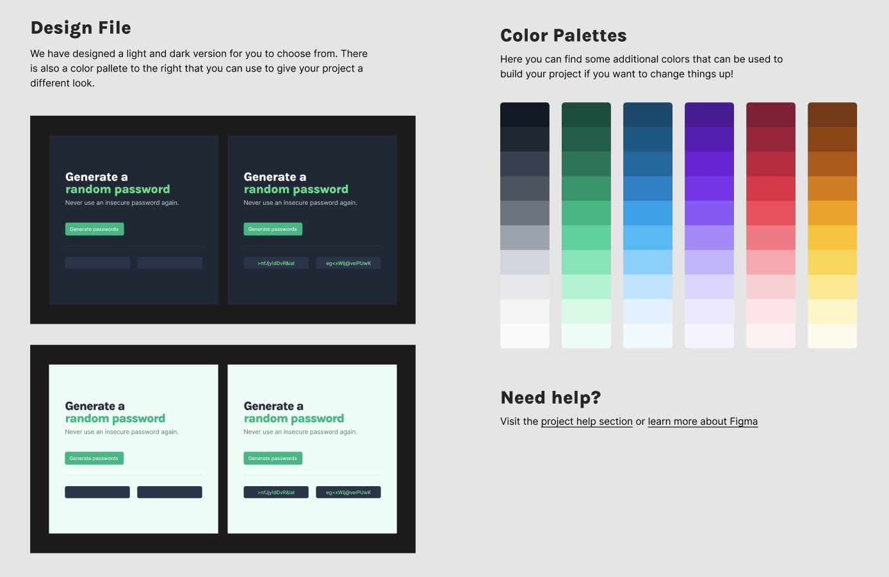
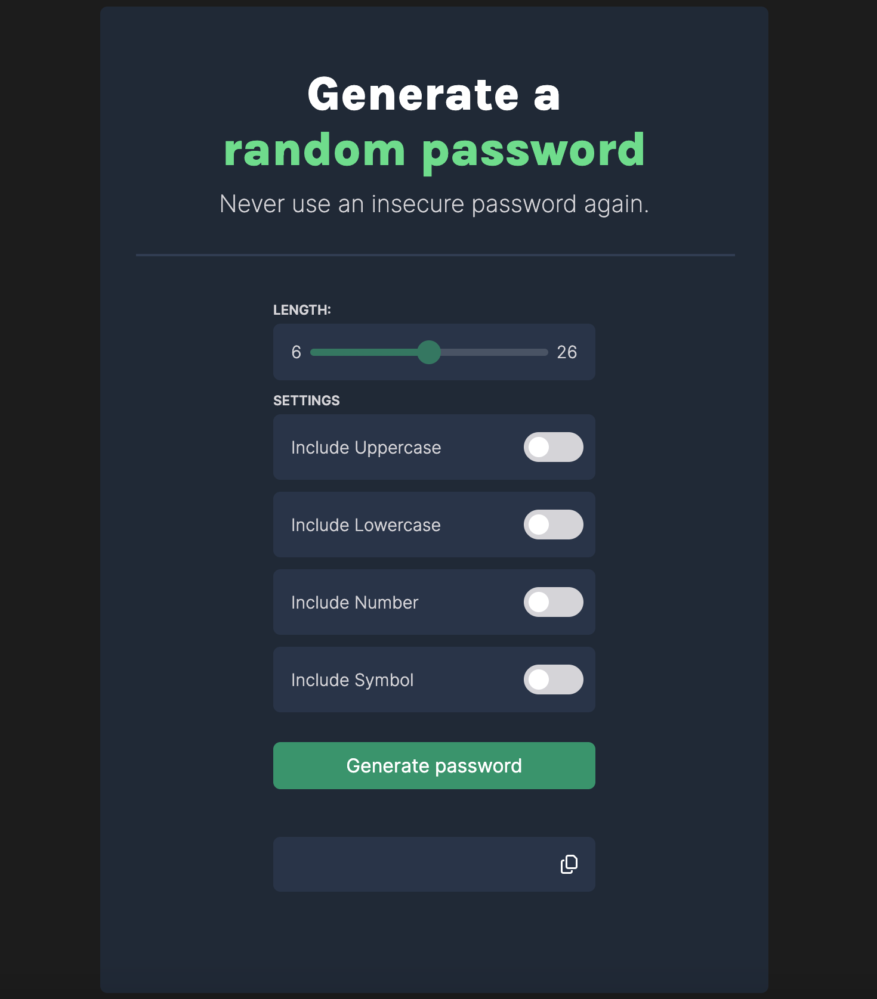
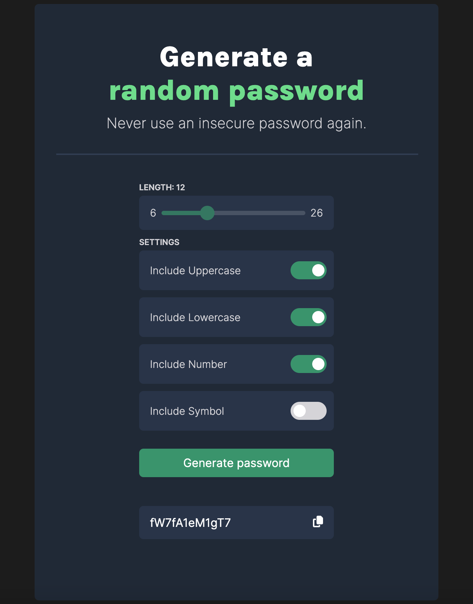

# Password Generator

This project is a Password Generator web application developed as part of the Scrimba Front End Developer Path. The application, inspired by a design provided in Figma, has been customized to enhance functionality and user experience. It allows users to generate secure passwords with adjustable settings for length and character types.

## Table of Contents

- [Features](#features)
- [Design and Style](#design-and-style)
- [Usage](#usage)
- [Credits](#credits)
- [License](#license)
- [Questions](#questions)

## Features

- **Customizable Length**: Users can adjust the password length between 6 to 26 characters using a slider.
- **Character Type Selection**: Options to include uppercase letters, lowercase letters, numbers, and symbols in the password.
- **Interactive UI**: Real-time updates to the slider and checkbox states.
- **Clipboard Integration**: Easy copying of the generated password to the clipboard.

## Design and Style

The application adopts a modern and clean interface based on initial designs provided in Figma, which were customized for added functionality and aesthetic appeal. The design uses Google Fonts for typography and adheres to a dark theme that is easy on the eyes, promoting an intuitive user experience on various devices.

## Usage

To use the Password Generator:

1. Visit the Password Generator [here](adriannaderkacz.github.io/password-generator-2/).
2. Adjust the password length using the slider.
3. Select the character types you wish to include in the password (uppercase, lowercase, numbers, symbols).
4. Click the "Generate password" button to create a random password.
5. Click the copy icon to copy the password to the clipboard.

The application is accessible via web browsers and does not require any installations.

## Credits

- **Design Inspiration**: Scrimba's Figma design as a part of [Scrimba Frontend Developer Path](https://scrimba.com/learn/frontend)'s project.
- **Documentation and Tutorials**: Extensive use of [W3Schools](https://www.w3schools.com) for JavaScript, CSS, and HTML guidance.

## License

MIT License

Copyright (c) [2024] [Adrianna Derkacz]

Permission is hereby granted, free of charge, to any person obtaining a copy of this software and associated documentation files (the "Software"), to deal in the Software without restriction, including without limitation the rights to use, copy, modify, merge, publish, distribute, sublicense, and/or sell copies of the Software, and to permit persons to whom the Software is furnished to do so, subject to the following conditions:

The above copyright notice and this permission notice shall be included in all copies or substantial portions of the Software.

THE SOFTWARE IS PROVIDED "AS IS", WITHOUT WARRANTY OF ANY KIND, EXPRESS OR IMPLIED, INCLUDING BUT NOT LIMITED TO THE WARRANTIES OF MERCHANTABILITY, FITNESS FOR A PARTICULAR PURPOSE AND NONINFRINGEMENT. IN NO EVENT SHALL THE AUTHORS OR COPYRIGHT HOLDERS BE LIABLE FOR ANY CLAIM, DAMAGES OR OTHER LIABILITY, WHETHER IN AN ACTION OF CONTRACT, TORT OR OTHERWISE, ARISING FROM, OUT OF OR IN CONNECTION WITH THE SOFTWARE OR THE USE OR OTHER DEALINGS IN THE SOFTWARE.

## Questions

For questions, please contact me at a.derkacz@gmail.com.
GitHub: [adriannaderkacz](https://github.com/adriannaderkacz).
